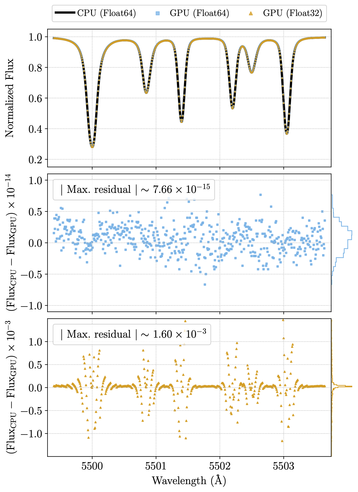

# Caveats

TODO.

## GPU Implementation

GRASS includes a GPU implementation that has been validated to reproduce the results of the fiducial CPU implementation within numerical precision. However, catastrophic cancellation in an internal interpolation operation can create large flux errors when using single precision floats (see the figure below, reproduced from [Palumbo et al. 2024a](https://arxiv.org/abs/2405.07945)). By default, GRASS uses double precision floats in the GPU implementation, but this may incur a performance penalty for certain hardware. 

<!--  -->

<!--  -->