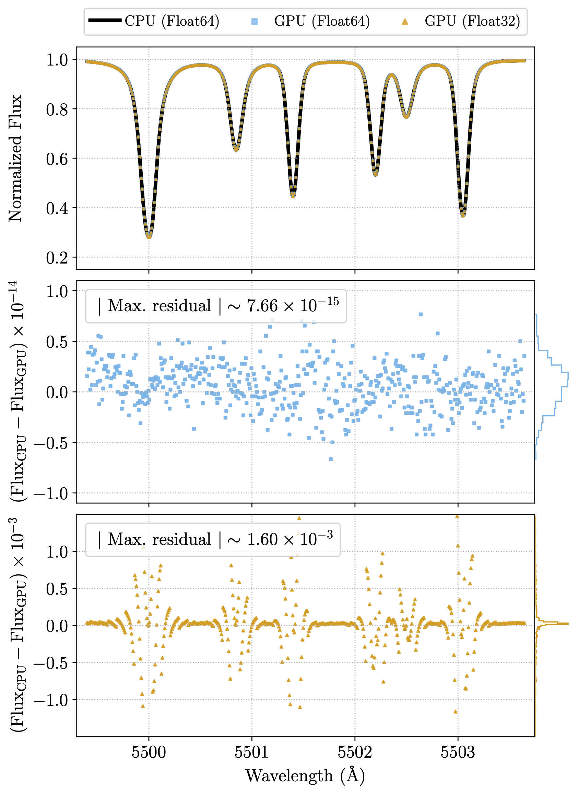

# Caveats

GRASS is an **empirical** simulator: it reproduces granulation-driven line-shape variability by replaying spatially- and temporally-resolved solar observations, rather than computing line profiles from first-principles hydrodynamics. This design makes GRASS fast and faithful to the real Sun, but it also means the model is only valid under the conditions in which its input data were obtained. The caveats below summarize those conditions. For the complete discussion, please read the papers presenting GRASS:

   * [Palumbo et al. (2022)](https://arxiv.org/abs/2110.11839) — GRASS v1.0
   * [Palumbo et al. (2024a)](https://arxiv.org/abs/2405.07945) — GRASS v2.0

## Physical Effects That Are Not Modeled

GRASS models the spectral variability driven by **granulation** (and the associated convective blueshift). It does **not** model several other sources of stellar variability:

   * **Magnetic activity:** Spots, faculae, and plage are not included. The input data were taken in quiet-Sun regions only, and the v1.0 template line (Fe I 5434.5 Å) is deliberately magnetically insensitive. Bisector distortions caused by magnetic fields are therefore unmodeled.
   * **Supergranulation and other long-timescale phenomena:** The input observations are short (≈20-minute sequences). They capture the short timescales relevant to granulation well, but do not contain longer-timescale magnetoconvective signals such as supergranulation.
   * **p-mode oscillations:** Although p-modes are present in the input data, the disk-integration procedure destroys their phase coherence. As a result, simulated RV RMS values can appear lower than they would in real data where pulsations contribute coherently.

When comparing GRASS output to observations, remember that the observed variability budget includes all of these effects, while GRASS does not.

## Stellar Type Applicability

GRASS is informed entirely by solar observations and is validated for the Sun (≈G2V). Applying it to other spectral types is not validated and should be done only with extreme caution and strong caveats. Because granulation properties change with stellar type, the empirical templates are not guaranteed to transfer.

## Spectral Line and Wavelength Applicability

   * **v1.0** is built on and validated for a single line, **Fe I 5434.5 Å**. Synthesizing lines in spectral regions far from this neighborhood should be done cautiously.
   * **v2.0** expands the input library to **22 solar lines** that are sufficiently deep and unblended, observed at 41 disk positions. v2.0 uses these templates to reconstruct their own disk-integrated profiles; choosing the best template for an arbitrary, unobserved line remains an open problem and is left to future work.
   * **Limb-darkening wavelength dependence:** Limb darkening is stronger at shorter wavelengths, which increases the relative importance of the bisector shape near disk center. This is one reason caution is warranted far from the validated wavelengths.

### Extrapolation to Shallow Lines

GRASS models shallower lines by truncating and interpolating the input bisectors. Because the input line bisectors are only measured up to ~80% of the continuum and are **extrapolated above that**, synthetic lines shallower than ~20% of the continuum are based **solely on extrapolated data**. Treat very shallow synthetic lines accordingly.

## Temporal Baseline

The input data span only ≈20 minutes. To produce longer time series, GRASS cycles repeatedly through this input. This can introduce spurious correlations on timescales longer than the input baseline, so long-duration simulations should be interpreted with that periodicity in mind.

## GPU Implementation and Numerical Precision

GRASS includes a GPU implementation that has been validated to reproduce the results of the fiducial CPU implementation within numerical precision. However, **catastrophic cancellation** in an internal interpolation operation can produce large flux errors when using single-precision floats (see the figure below, reproduced from [Palumbo et al. 2024a](https://arxiv.org/abs/2405.07945)). For this reason GRASS uses **double-precision** floats in the GPU implementation by default. This is the safe choice, but it may incur a performance penalty on hardware with limited double-precision throughput (e.g. many consumer GPUs).

