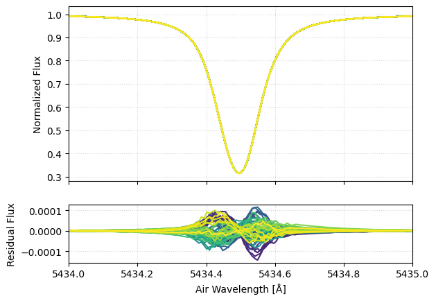
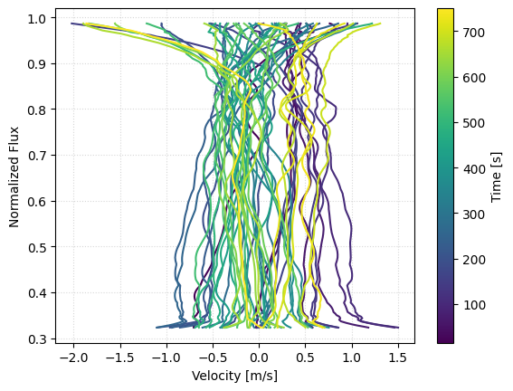

# Basic Usage

The most basic use case of GRASS is generating time series of synthetic spectra and measuring apparent velocities. These can both be done in only a few lines of code.

## Generating Synthetic Spectra

The simplest use case for GRASS is the generation of time series of synthetic spectra. This can be done in only a few lines of code. The following example generates 25 spectra consisting of a single line at 5434.5 Angstroms. By default, the temporal spacing of the spectra is 15 seconds.

```@eval
using Markdown
code = read(joinpath(pwd(), "..", "scripts", "simple.jl"), String)
break_marker = "# BREAK1"
stop_idx = findfirst(break_marker, code)
code = stop_idx === nothing ? code : code[1:prevind(code, stop_idx.start)]
Markdown.parse("```julia\n" * code * "\n```")
```


## Measuring Velocities

GRASS wraps the [EchelleCCFs package](https://github.com/RvSpectML/EchelleCCFs.jl) to measure apparent Doppler velocities from spectra.

```@eval
using Markdown
code = read(joinpath(pwd(), "..", "scripts", "simple.jl"), String)
start_marker = "# BREAK1"
end_marker = "# BREAK2"
start_idx = findfirst(start_marker, code)
end_idx = findfirst(end_marker, code)
if start_idx !== nothing && end_idx !== nothing && start_idx.start < end_idx.start
    start_nl = findnext('\n', code, start_idx.start)
    slice_start = start_nl === nothing ? lastindex(code) + 1 : nextind(code, start_nl)
    slice_end = prevind(code, end_idx.start)
    code = slice_start <= slice_end ? code[slice_start:slice_end] : ""
end
Markdown.parse("```julia\n" * code * "\n```")
```


## Measuring Bisectors

GRASS wraps the [EchelleCCFs package](https://github.com/RvSpectML/EchelleCCFs.jl) to measure apparent Doppler velocities from spectra.

```@eval
using Markdown
code = read(joinpath(pwd(), "..", "scripts", "simple.jl"), String)
start_marker = "# BREAK2"
end_marker = "# BREAK3"
start_idx = findfirst(start_marker, code)
end_idx = findfirst(end_marker, code)
if start_idx !== nothing && end_idx !== nothing && start_idx.start < end_idx.start
    start_nl = findnext('\n', code, start_idx.start)
    slice_start = start_nl === nothing ? lastindex(code) + 1 : nextind(code, start_nl)
    slice_end = prevind(code, end_idx.start)
    code = slice_start <= slice_end ? code[slice_start:slice_end] : ""
end
Markdown.parse("```julia\n" * code * "\n```")
```


We can also examine the mean-subtracted bisectors to better see the temporal variability in line shape created by granulation.

```@eval
using Markdown
code = read(joinpath(pwd(), "..", "scripts", "simple.jl"), String)
start_marker = "# BREAK3"
end_marker = "# BREAK4"
start_idx = findfirst(start_marker, code)
end_idx = findfirst(end_marker, code)
if start_idx !== nothing && end_idx !== nothing && start_idx.start < end_idx.start
    start_nl = findnext('\n', code, start_idx.start)
    slice_start = start_nl === nothing ? lastindex(code) + 1 : nextind(code, start_nl)
    slice_end = prevind(code, end_idx.start)
    code = slice_start <= slice_end ? code[slice_start:slice_end] : ""
end
Markdown.parse("```julia\n" * code * "\n```")
```
